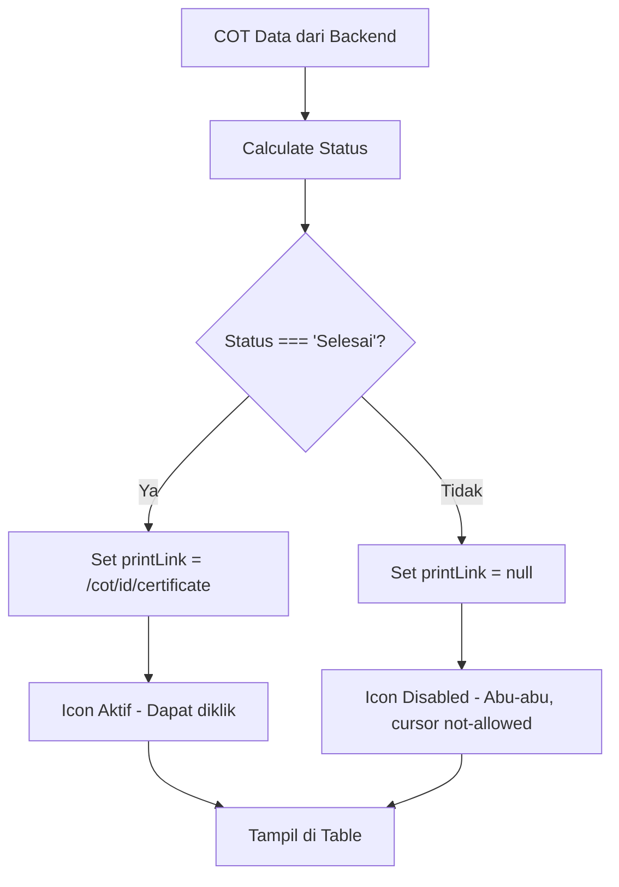

# 🎯 IMPLEMENTASI: Icon Sertifikat Berdasarkan Status COT

## Overview
Implementasi ini menyelesaikan masalah inkonsistensi icon "Buat/Lihat Sertifikat" pada tabel Calendar of Training (COT). Icon sertifikat sekarang hanya akan aktif untuk COT dengan status "Selesai" dan akan disabled (dengan visual feedback) untuk COT dengan status "Akan datang" atau "Sedang berjalan".

## Masalah yang Diselesaikan
- Icon sertifikat sebelumnya muncul untuk semua COT tanpa mempertimbangkan status
- Tidak ada indikasi visual mengapa beberapa icon sertifikat tidak dapat diklik
- User experience yang tidak konsisten karena icon aktif untuk COT yang belum selesai

## Solusi Implementasi

### 1. **Status COT Calculator**
```typescript
private getCotStatus(startDate: string, endDate: string): string {
  const today = new Date();
  today.setHours(0, 0, 0, 0);
  
  const start = new Date(startDate);
  start.setHours(0, 0, 0, 0);
  
  const end = new Date(endDate);
  end.setHours(23, 59, 59, 999);
  
  if (today < start) {
    return 'Akan datang';
  } else if (today >= start && today <= end) {
    return 'Sedang berjalan';
  } else {
    return 'Selesai';
  }
}
```

### 2. **Conditional Certificate Link**
```typescript
// Icon sertifikat hanya tersedia untuk COT dengan status "Selesai"
const cotStatus = this.getCotStatus(cot.startDate, cot.endDate);
const certificateLink = cotStatus === 'Selesai' ? `/cot/${cot.id}/certificate` : null;

const mappedCot = {
  // ... properties lainnya
  printLink: certificateLink,
  _cotStatus: cotStatus // untuk debugging
};
```

### 3. **Visual Feedback untuk Icon Disabled**

#### HTML Template (icon-action.component.html)
```html
<!-- Icon aktif untuk COT selesai -->
<span *ngIf="printLink">
  <i class="fa-solid fa-print" 
     [routerLink]="[getPrintLinkPath()]"
     title="Buat/Lihat Sertifikat"></i>
</span>

<!-- Icon disabled untuk COT belum selesai -->
<span *ngIf="!printLink && (editLink || delete || detailLink)" 
      class="disabled-certificate-icon">
  <i class="fa-solid fa-print disabled-icon"
     title="Sertifikat belum tersedia - COT belum selesai"></i>
</span>
```

#### CSS Styling
```css
.disabled-certificate-icon {
  display: inline-block;
  position: relative;
}

.disabled-icon {
  color: #cccccc !important;
  cursor: not-allowed !important;
  opacity: 0.5;
}

.disabled-icon:hover {
  color: #cccccc !important;
  cursor: not-allowed !important;
}
```

## Files Modified

### 1. **cot-list.component.ts**
- Menambahkan method `getCotStatus()` untuk menentukan status COT
- Mengubah logic mapping data untuk mengset `printLink` berdasarkan status
- Implementasi berlaku di 3 tempat:
  - `getListCot()` - data langsung dari backend
  - `finalizeAdaptiveData()` - data dari adaptive fetching  
  - `paginateFromCache()` - data dari cache

### 2. **icon-action.component.html**
- Menambahkan kondisi untuk menampilkan icon disabled
- Logic: tampilkan icon disabled hanya jika `!printLink` dan ada action icons lain

### 3. **icon-action.component.css**
- Menambahkan style untuk `.disabled-icon` dan `.disabled-certificate-icon`
- Visual feedback: warna abu-abu, opacity rendah, cursor not-allowed

## Logic Flow



## Status COT Mapping

| Kondisi | Status | Icon Behavior |
|---------|--------|---------------|
| `today < startDate` | "Akan datang" | 🚫 Disabled (abu-abu) |
| `startDate <= today <= endDate` | "Sedang berjalan" | 🚫 Disabled (abu-abu) |
| `today > endDate` | "Selesai" | ✅ Aktif (dapat diklik) |

## User Experience Improvements

1. **Konsistensi Visual**: Semua icon sertifikat memiliki perilaku yang konsisten
2. **Feedback yang Jelas**: Icon disabled memiliki visual feedback yang jelas
3. **Tooltip Informatif**: Tooltip menjelaskan mengapa icon tidak dapat diklik
4. **Intuitive UX**: User langsung memahami status COT dari tampilan icon

## Testing Scenarios

1. **COT Akan Datang**: Icon sertifikat abu-abu, tidak dapat diklik
2. **COT Sedang Berjalan**: Icon sertifikat abu-abu, tidak dapat diklik  
3. **COT Selesai**: Icon sertifikat normal, dapat diklik untuk buat/lihat sertifikat
4. **Mixed Status**: Dalam satu tabel, beberapa icon aktif dan beberapa disabled

## Future Enhancements

1. **Dynamic Status Updates**: Real-time update status COT berdasarkan waktu sistem
2. **Status Badge**: Tambahkan badge status COT di kolom terpisah
3. **Bulk Certificate Actions**: Aksi massal untuk COT yang sudah selesai
4. **Certificate Generation Notification**: Notifikasi ketika sertifikat siap dibuat

## Notes
- Implementasi ini backward compatible dan tidak mengubah API atau database schema
- Semua perubahan bersifat frontend-only dengan logika business yang robust
- Performance impact minimal karena hanya menambahkan kalkulasi tanggal sederhana
- Debugging information tersimpan di `_cotStatus` untuk troubleshooting
